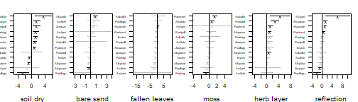
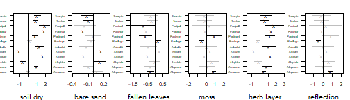
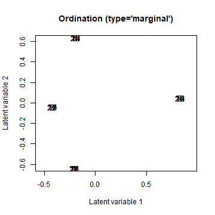
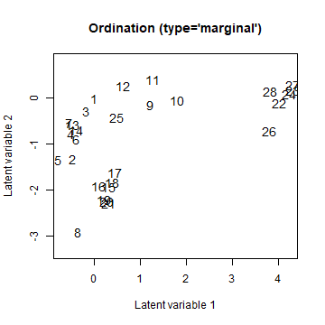
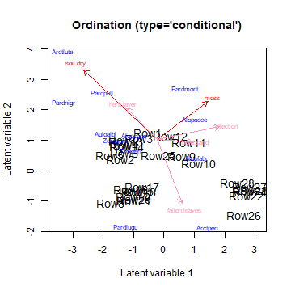

Until recently, the `gllvm` R-package only supported unconstrained ordination. When including predictor variables, the interpretation of the ordination would shift to a residual ordination, conditional on the predictors.

However, if the number of predictor variables is large and so is the number of species, including predictors can result in a very large number of parameters to estimate. For data of ecological communities, which can be quite sparse, this is not always a reasonable model to fit. As alternative, ecologists have performed constrained ordination for decades, with methods such as Canonical Correspondence Analysis, or Redundancy Analysis. Alternatively, these methods can be viewed as determining "gradients" (a.k.a. latent variables) as a linear combination of the predictor variables. 

In this vignette, we demonstrate how to include predictors directly in an ordination with the `gllvm` R-package. Methods are explained with details in @vanderVeen2021b. We start by loading the hunting spider dataset:


``` r
library(gllvm)

data("spider", package = "mvabund")
Y <- spider$abund
X <- spider$x

#And scale the predictors
X <- scale(X)
```
which includes six predictor variables: "soil.dry": soil dry mass, "bare.sand": cover bare sand, "fallen.leaves": "cover of fallen leaves", "moss": cover moss, "herb.layer": cover of the herb layer, "reflection": "reflection of the soil surface with a cloudless sky". 

## Constrained ordination
Let us first consider what constrained ordination actually is. We will do that by first shortly explaining reduced rank regression (RRR). First, consider the model:

$$
\eta_{ij} = \beta_{0j} + \boldsymbol{X}_i^\top\boldsymbol{\beta}_j.
$$

Here, $\boldsymbol{\beta}_j$ are the slopes that represent a species responses to $p$ predictor variables at site $i$, $\boldsymbol{X}_i$. In the `gllvm` R-package, the code to fit this model is:


``` r
MGLM <- gllvm(Y, X = X, family = "poisson", num.lv = 0)
```
where we set the number of unconstrained latent variables to zero, as it defaults to two. The "rank" of $\boldsymbol{X}_i^\top\boldsymbol{\beta}_j$ is $p$. Constrained ordination introduces a constraint on the species slopes matrix, namely on the number of independent columns in $\boldsymbol{\beta}_j$ (a column is not independent when it can be formulated as a linear combination of another). The reduced ranks are in community ecology referred to as ecological gradients, but can also be understood as ordination axes or latent variables. If we define a latent variable $\boldsymbol{z}_i = \boldsymbol{B}^\top\boldsymbol{X}_{i,lv} + \boldsymbol{\epsilon}_i$, for a $p\times d$ matrix of slopes, we can understand constrained ordination as a regression of the latent variable or ecological gradient, except that the residual $\boldsymbol{\epsilon}_i$ is omitted, i.e. we assume that the ecological gradient can be represented perfectly by the predictor variables, so that the model becomes:
\begin{equation}
\eta_{ij} = \beta_{0j} + \boldsymbol{X}_i^\top\boldsymbol{B}\boldsymbol{\gamma}_j.
\end{equation}

Where $\boldsymbol{B}$ is a $d \times K$ matrix of slopes per predictor and latent variable, and $\boldsymbol{\gamma}_j$ is a set of slopes for each species per latent variable. This parametrization is practically useful, as it drastically reduces the number of parameters compared to multivariate regression. The rank, number of latent variables or ordination axes, can be determined by cross-validation, or alternatively by using information criteria. The code for this in the `gllvm` R-package, for an arbitrary choice of two latent variables, is:


``` r
RRGLM <- gllvm(Y, X = X, family = "poisson", num.RR = 2)
```

The predictor slopes (called canonical coefficients in e.g., CCA or RDA) are available under `RRGLM$params$LvXcoef` or can be retrieved with `coef(RRGLM)` or by `summary(RRGLM)`:


``` r
summary(RRGLM, rotate = TRUE)
```

```
## 
## Call:
## gllvm(y = Y, X = X, family = "poisson", num.RR = 6, starting.val = "zero", 
##     reltol.c = 1e-15)
## 
## Family:  poisson 
## 
## AIC:  1841.216 AICc:  1898.108 BIC:  2161.853 LL:  -836.6 df:  84 
## 
## Informed LVs:  0 
## Constrained LVs:  6 
## Unconstrained LVs:  0 
## 
## Formula:  ~ 1 
## LV formula:  ~soil.dry + bare.sand + fallen.leaves + moss + herb.layer + reflection 
## Row effect:  ~ 1 
## 
## Coefficients LV predictors:
##                      Estimate Std. Error z value Pr(>|z|)    
## soil.dry(CLV1)       0.739241   0.545770   1.354  0.17558    
## bare.sand(CLV1)     -1.504227   0.738137  -2.038  0.04156 *  
## fallen.leaves(CLV1)  0.249424   1.567803   0.159  0.87360    
## moss(CLV1)          -0.406028   1.325428  -0.306  0.75935    
## herb.layer(CLV1)     1.983275   1.046501   1.895  0.05807 .  
## reflection(CLV1)    -2.069525   0.941468  -2.198  0.02794 *  
## soil.dry(CLV2)      -0.524884   0.325749  -1.611  0.10711    
## bare.sand(CLV2)     -0.761665   0.395216  -1.927  0.05395 .  
## fallen.leaves(CLV2) -0.877375   0.969414  -0.905  0.36543    
## moss(CLV2)           0.130217   0.659360   0.197  0.84344    
## herb.layer(CLV2)     1.793405   0.584467   3.068  0.00215 ** 
## reflection(CLV2)     0.315377   0.600692   0.525  0.59957    
## soil.dry(CLV3)       0.750252   0.988362   0.759  0.44780    
## bare.sand(CLV3)     -0.897121   0.928729  -0.966  0.33406    
## fallen.leaves(CLV3) -1.145885   1.649139  -0.695  0.48716    
## moss(CLV3)          -0.342914   0.768733  -0.446  0.65554    
## herb.layer(CLV3)    -1.345636   1.047277  -1.285  0.19883    
## reflection(CLV3)     0.820609   0.674645   1.216  0.22385    
## soil.dry(CLV4)      -0.997668   0.514773  -1.938  0.05261 .  
## bare.sand(CLV4)     -0.522736   0.432766  -1.208  0.22709    
## fallen.leaves(CLV4) -0.606122   1.004898  -0.603  0.54640    
## moss(CLV4)           0.150650   0.698787   0.216  0.82931    
## herb.layer(CLV4)     0.026434   0.669088   0.040  0.96849    
## reflection(CLV4)    -1.211241   0.496380  -2.440  0.01468 *  
## soil.dry(CLV5)       0.592508   0.230516   2.570  0.01016 *  
## bare.sand(CLV5)      0.430542   0.196589   2.190  0.02852 *  
## fallen.leaves(CLV5) -0.814613   0.341699  -2.384  0.01713 *  
## moss(CLV5)           0.289127   0.182575   1.584  0.11328    
## herb.layer(CLV5)    -0.160839   0.253159  -0.635  0.52521    
## reflection(CLV5)    -0.726094   0.149143  -4.868 1.12e-06 ***
## soil.dry(CLV6)      -0.031456   0.020354  -1.545  0.12224    
## bare.sand(CLV6)      0.004485   0.014587   0.307  0.75850    
## fallen.leaves(CLV6) -0.057097   0.033731  -1.693  0.09051 .  
## moss(CLV6)          -0.086429   0.020041  -4.313 1.61e-05 ***
## herb.layer(CLV6)    -0.015565   0.019434  -0.801  0.42316    
## reflection(CLV6)    -0.009270   0.014017  -0.661  0.50840    
## ---
## Signif. codes:  0 '***' 0.001 '**' 0.01 '*' 0.05 '.' 0.1 ' ' 1
```

Note the use of the `rotate` argument. This ensures that the solution of the canonical coefficients is rotated to the same solution as displayed in `ordiplot` (which has the same `rotate` argument that is by default set to TRUE). The summary can be useful in determining what drives vertical and horizontal shifts in the location of species and sites in the ordination diagram (but probably not for much more than that).

Unlike the canonical coefficients, the reconstructed species-specific effects are invariant to rotation, so that it is always good practice to additionally study those for more exhaustive inference;


``` r
coefplot(RRGLM, cex.ylab = 0.5, mar = c(4,2,2,1))
```

<div class="figure" style="text-align: center">

<p class="caption">plot of chunk coefsP</p>
</div>

To fit a constrained ordination we make use of additional optimization routines from the \texttt{alabama} and \texttt{nloptr} R-packages. This is necessary, because without the constraint that the predictor slopes are orthogonal the model is *unidentifiable*. It might thus happen, that after fitting the model a warning pops-up along the lines of *predictor slopes are not orthogonal*, in which case you will have to re-fit the model with a different optimization routine (`optimizer='alabama'`) or starting values (`starting.values='zero'`) in order to get the constraints on the canonical coefficients to better converge.

Note: in general to improve convergence, it is good practice to center and scale the predictor variables. 

### Random slopes

Generally, constrained ordination can have difficulty in estimating the predictor slopes, for example due to co-linearity between the predictors. One way to solve this, is using regularisation. Regularisation adds a penalty to the objective function, as to shrink parameter estimates closer to zero that are unimportant. A convenient way to add this penalty, is by formulating a random slopes model. In `gllvm` this is done with the following syntax:


``` r
RRGLMb1 <- gllvm(Y, X = X, family="poisson", num.RR = 2, randomB = "LV")
RRGLMb1 <- gllvm(Y, X = X, family="poisson", num.RR = 2, randomB = "P")
```

where the `randomB` argument is additionally used to specify if variances of the random slopes should be unique per latent variable (i.e. assume that the random slopes per predictor come from the same distribution), or per predictor (i.e. assume that the random slopes per latent variable come from the same distribution). Either setting has benefits, the first implies covariance between species responses to a predictor, whereas the latter can serve to shrink effects of a single predictor to near zero. In general, it has the potential to stabilize model fitting and reduce variance of the parameter estimates. Finally, a slope for a categorical predictor is an intercept, so this formulation also allows to include random intercepts in the ordination.

A plot of species-specific effects can be constructed with the  `randomCoefplot` function:

``` r
randomCoefplot(RRGLMb1, cex.ylab = 0.5, mar = c(4,2,2,1))
```

<div class="figure" style="text-align: center">

<p class="caption">plot of chunk rcoefs</p>
</div>

When using a random-effects formulation, there is no summary table and there are no confidence intervals available for the canonical coefficients. It is possible to construct a summary table with the prediction of the random-effects and the association prediction errors as follows:


``` r
# Get coefficients
coefs<-data.frame(coef(RRGLMb1,"LvXcoef"))
coefs$Predictor <- row.names(coefs)

# Wide to long
coefsTab<-reshape(coefs, 
        direction = "long",
        varying = list(colnames(coefs)[1:(RRGLMb1$num.lv.c+RRGLMb1$num.RR)]),
        v.names = "Estimate", 
        times=colnames(coefs)[1:(RRGLMb1$num.lv.c+RRGLMb1$num.RR)], 
        timevar = "LV",
        new.row.names = NULL)
# Add prediction errors
coefsTab <- cbind(coefsTab,PE=c(getPredictErr(RRGLMb1)$b.lv))
row.names(coefsTab)<-1:nrow(coefsTab)
coefsTab[,-4]
```

```
##        Predictor   LV    Estimate         PE
## 1       soil.dry CLV1 -0.03060679 0.07595329
## 2      bare.sand CLV1  0.06496518 0.05952885
## 3  fallen.leaves CLV1 -0.33992690 0.10803090
## 4           moss CLV1  0.83103837 0.09507550
## 5     herb.layer CLV1  0.46862694 0.11450077
## 6     reflection CLV1  0.78034055 0.12797780
## 7       soil.dry CLV2  0.91414792 0.09913801
## 8      bare.sand CLV2 -0.11276960 0.04106647
## 9  fallen.leaves CLV2 -0.25673882 0.14442907
## 10          moss CLV2 -0.21977825 0.32165464
## 11    herb.layer CLV2  0.63662194 0.19660301
## 12    reflection CLV2 -0.21137650 0.29998929
```

There is a range of potential use cases for random canonical coefficients, but pragmatically, inducing some shrinkage on the predictor effects can result in more better "behaved" (fewer outliers) ordination plots. 

Incorporating correlation between the canonical coefficients is (currently) only possible in combination with `randomB="P"`. This assumes that the canonical coefficients per LV are drawn from a covariance matrix that is specified with the `lv.formula` argument:


``` r
RRGLMb2 <- gllvm(Y, X = X, lv.formula = ~(0+soil.dry+bare.sand+fallen.leaves+moss+herb.layer+reflection|1), family="poisson", num.RR = 2, randomB = "P")
summary(RRGLMb2)
```

```
## 
## Call:
## gllvm(y = Y, X = X, family = "poisson", num.RR = 2, lv.formula = ~(0 + 
##     soil.dry + bare.sand + fallen.leaves + moss + herb.layer + 
##     reflection | 1), randomB = "P")
## 
## Family:  poisson 
## 
## AIC:  2402.894 AICc:  2413.434 BIC:  2551.761 LL:  -1162.4 df:  39 
## 
## Informed LVs:  0 
## Constrained LVs:  2 
## Unconstrained LVs:  0 
## 
## Formula:  ~ 1 
## LV formula:  ~(0 + soil.dry + bare.sand + fallen.leaves + moss + herb.layer + reflection | 1) 
## Row effect:  ~ 1 
## 
## Random effects LV predictors:
##  Name          Variance Std.Dev
##  soil.dry      0.4174   0.6461 
##  bare.sand     0.0049   0.0700 
##  fallen.leaves 0.1125   0.3354 
##  moss          0.3404   0.5835 
##  herb.layer    0.4036   0.6353 
##  reflection    0.3353   0.5790
```


For this, we make use of an adjusted version of the familiar lme4-formula interface [@lme4, @lme4_software]. This is equivalent to assuming that the matrix of species coefficients follows a matrix normal distribution $\boldsymbol{\beta} \sim \mathcal{MN}(\textbf{0}, \boldsymbol{\Sigma}, \boldsymbol{\Gamma}\boldsymbol{\Gamma}^\top)$, so that the correlations are indeed the correlation of the predictor effects, estimated in reduced rank, and the species loadings form the column-covariance matrix, i.e., provide the species correlations in reduced rank.

### Group-level unconstrained ordination

Frequently, ecological datasets contain some kind of grouping structure. In these cases we might want to define the ordination at the group-level, rather than having a score for each row in the response matrix. An ordination where the scores are grouped based on (e.g., areas, plots or other groups) is also a constrained (or concurrent, see below) ordination. If there are only grouping variables, and no other predictors, the ordination is constrained relative to an ordination where the scores are defined per row in the response matrix, but the group-level scores themselves are unconstrained. If there are also other (continuous) predictors that is also fine, it just meansn that we end up with a concurrent ordination where the LV-level error is defined at the group-level.

Here is an example with four artificial groups:


``` r
groupUGLLVM <- gllvm(Y, X = data.frame(group = rep(1:4, 7)), lv.formula = ~(1|group), family="poisson", num.RR = 2, randomB = "LV", starting.val = "zero") # starting.val added because it gave a better fit here
ordiplot(groupUGLLVM, arrow.scale = 0)
```

<div class="figure" style="text-align: center">

<p class="caption">plot of chunk ordip6_1</p>
</div>

## Fixed effects unconstrained ordination

Following the same ideas, we can also abuse the `num.RR` interface to fit a fixed effects unconstrained ordination:


``` r
fixUGLLVM <- gllvm(Y, X = data.frame(site = as.factor(1:nrow(Y))), lv.formula = ~site, family="poisson", num.RR = 2) # starting.val added because it gave a better fit here
ordiplot(fixUGLLVM, arrow.scale = 0)
```
<div class="figure" style="text-align: center">

<p class="caption">plot of chunk fixuGLLVM</p>
</div>

## Concurrent ordination

Unlike in other R-packages, we can now formulate a ordination where additional random-effects are included that act like LV-level residuals (because let's face it, how often are we 100% confident that we have measured all relevant predictors?), so that we can assume that the ecological gradient is represented by unmeasured and measured predictors (the former is how the residual can be understood). The code for this is:


``` r
CGLLVM <- gllvm(Y, X = X, family = "poisson", num.lv.c = 2)
```

where the `num.lv.c` argument is used to specify the number of latent variables for the concurrent ordination (i.e. latent variables informed by the predictors but not constrained), where previously the `num.RR` argument was used to specify the number of constrained latent variables. The number of constrained, informed, and unconstrained latent variables can be freely combined using the `num.RR`, `num.lv.c` and `num.lv` arguments (but be careful not to overparameterize or overfit your model!). 

## Partial constrained or concurrent ordination

It is also possible to combine constrained or concurrent ordination with full-rank predictor effects. To combine concurrent ordination with full-rank predictor effects you need to additionally use the formula interface:


``` r
PCGLLVM <- gllvm(Y, X = X, family = "poisson", num.lv.c = 2, 
                 lv.formula = ~bare.sand + fallen.leaves + moss+herb.layer + reflection, 
                 formula = ~soil.dry)
```

where `lv.formula` is the formula for the ordination with predictors (concurrent or constrained), and `formula` is the formula which tells the model which predictors should be partialled out of the ordination. Note, that those two formula arguments cannot include the same predictor variables, and all predictor variables should be provided in the `X` argument. In essence, this performs a partial concurrent ordination, or with `num.RR` a partial constrained ordination. These effects that are partialled out of the ordination (that the ordination is conditioned on) can also be treated as random effects, which is sometimes preferable. Partialled out here means that the effects are taken out of the ordination: the effect of `soil.dry` is no longer visible in the ordination, and no arrow will be drawn for its effect. It is possible to inspect its effect on the species with the `coefplot` function, as it is for all covariate effects in the model, inside the ordination and outside.

Information criteria can be used to determine the correct number of latent variables, though we did not demonstrate this here. Results of the model can be examined in more details using the `summary(\cdot)` function:


``` r
summary(CGLLVM)
```

```
## 
## Call:
## gllvm(y = Y, X = X, num.lv.c = 2, family = "poisson", starting.val = "zero")
## 
## Family:  poisson 
## 
## AIC:  1665.321 AICc:  1680.282 BIC:  1840.908 LL:  -786.7 df:  46 
## 
## Informed LVs:  2 
## Constrained LVs:  0 
## Unconstrained LVs:  0 
## Residual standard deviation of LVs:  0.6577 0.5729 
## 
## Formula:  ~ 1 
## LV formula:  ~soil.dry + bare.sand + fallen.leaves + moss + herb.layer + reflection 
## Row effect:  ~ 1 
## 
## Coefficients LV predictors:
##                     Estimate Std. Error z value Pr(>|z|)    
## soil.dry(CLV1)      -0.98389    0.33529  -2.934 0.003342 ** 
## bare.sand(CLV1)      0.47349    0.23214   2.040 0.041380 *  
## fallen.leaves(CLV1)  0.33758    0.39012   0.865 0.386866    
## moss(CLV1)           0.67915    0.31526   2.154 0.031224 *  
## herb.layer(CLV1)    -0.40845    0.22679  -1.801 0.071706 .  
## reflection(CLV1)     0.83825    0.37495   2.236 0.025376 *  
## soil.dry(CLV2)       0.93546    0.26428   3.540 0.000401 ***
## bare.sand(CLV2)     -0.02443    0.19079  -0.128 0.898113    
## fallen.leaves(CLV2) -0.84909    0.31374  -2.706 0.006803 ** 
## moss(CLV2)           0.51290    0.23897   2.146 0.031851 *  
## herb.layer(CLV2)     0.42712    0.19684   2.170 0.030013 *  
## reflection(CLV2)     0.17366    0.31602   0.550 0.582646    
## ---
## Signif. codes:  0 '***' 0.001 '**' 0.01 '*' 0.05 '.' 0.1 ' ' 1
```

Finally, we can use all the other tools in the \texttt{gllvm} R-package for inference, such as creating an ordination diagram with arrows:


``` r
ordiplot(CGLLVM, biplot = TRUE)
```

<div class="figure" style="text-align: center">

<p class="caption">plot of chunk ordip6_3</p>
</div>

Arrows that show as less intense red (pink), are predictors of which the confidence interval for the slope includes zero, for at least one of the two plotted dimensions. There are various arguments included in the function to improve readability of the figure, have a look at its documentation. The arrows are always proportional to the size of the plot, so that the predictor with the largest slope estimate is the largest arrow. If the predictors have no effect, the slopes $\boldsymbol{B}$ will be close to zero.

It is also possible to use the `quadratic` flag to fit a quadratic response model though we will not demonstrate that here, or to partition variance per latent variable and for specific predictors.

# References

---
references:
- id: vanderVeen2021b
  title: Concurrent ordination - simultaneous unconstrained and constrained latent variable modelling
  author: 
  - family: van der Veen
    given: B.
  - family: Hui
    given: F.K.C.
  - family: Hovstad
    given: K.A.
  - family: O'Hara
    given: R.B.
  publisher: Methods in Ecology and Evolution
  volume: 14
  page: 683–695
  type: article-journal
  issued:
    year: 2023
- id: lme4_software
  title: "Lme4: Linear Mixed-Effects Models Using 'Eigen' and S4"
  author: 
    - family: Bates
      given: Douglas
    - family: Maechler
      given: Martin
    - family: Bolker
      given: Ben
    - family: Walker
      given: Steven
    - family: Christensen
      given: Rune Haubo Bojesen
    - family: Singmann
      given: Henrik
    - family: Dai
      given: Bin
    - family: Scheipl
      given: Fabian
    - family: Grothendieck
      given: Gabor
    - family: Green
      given: Peter
    - family: Fox
      given: John
    - family: Bauer
      given: Alexander
    - family: Krivitsky
      given: Pavel N.
    - family: Tanaka
      given: Emi
    - family: Jagan
      given: Mikael
  publisher: CRAN
  URL: "https://CRAN.R-project.org/package=lme4"
  type: software
  issued:
    year: 2024
    month: 07
    day: 03
  version: 1.1-35.5
- id: lme4
  title: Fitting Linear Mixed-effects Models using lme4
  author: 
  - family: Bates
    given: D.
  - family: Mächler
    given: M.
  - family: Bolker
    given: B.
  - family: Walker
    given: S.
  publisher: Journal of Statistical Software
  volume: 67
  page: 1--48
  type: article-journal
  issued:
    year: 2015
---
